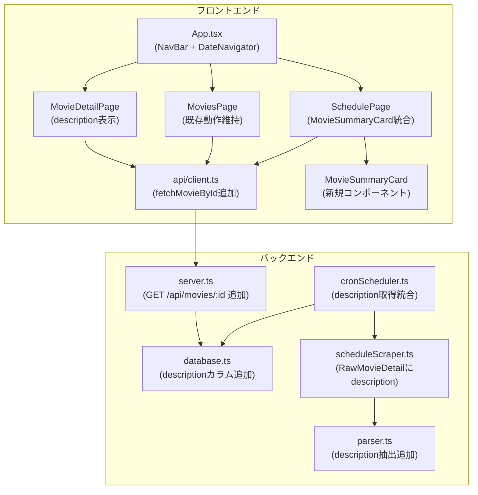

# 設計ドキュメント: schedule-movie-detail-integration

## 概要

本機能は、シネマスケジュールマネージャーに対して以下の改善を行う。

1. **スケジュールタブの作品単位カード表示**: 同一 `movieId` の上映回を1枚の `MovieSummaryCard` に統合し、クリックで `/movies/{movieId}` へ遷移できるようにする。
2. **映画詳細ページへの紹介文表示**: 公式サイトの映画詳細ページから作品紹介文をスクレイピングし、`description` フィールドとしてデータモデル全体に追加・表示する。
3. **全タブへの DateNavigator 共有**: `DateNavigator` を `App.tsx` の `NavBar` 直下に移動し、全タブで日付切り替えを共有する（2週間分表示）。

### 変更対象ファイルの全体像

```
バックエンド:
  packages/backend/src/types/index.ts          ← Movie型・ParsedMovieDetail型にdescription追加
  packages/backend/src/datastore/database.ts   ← moviesテーブルにdescriptionカラム追加（マイグレーション）
  packages/backend/src/scraper/parser.ts       ← parseMovieDetailPageにdescription抽出追加
  packages/backend/src/scraper/scheduleScraper.ts ← scrapeMovieDetailのRawMovieDetailにdescription追加
  packages/backend/src/scheduler/cronScheduler.ts ← 定期スクレイピングにdescription取得統合
  packages/backend/src/api/server.ts           ← GET /api/movies/:id エンドポイント追加

フロントエンド:
  packages/frontend/src/types/index.ts         ← Movie型にdescription追加
  packages/frontend/src/api/client.ts          ← fetchMovieById関数追加
  packages/frontend/src/App.tsx                ← NavBarにDateNavigator移動
  packages/frontend/src/pages/SchedulePage.tsx ← MovieSummaryCard統合表示・DateNavigator削除
  packages/frontend/src/pages/MoviesPage.tsx   ← 既存のクリック遷移動作を維持
  packages/frontend/src/pages/MovieDetailPage.tsx ← description表示追加・fetchMovieById使用
  packages/frontend/src/components/schedule/MovieSummaryCard.tsx ← 新規作成
```

---

## アーキテクチャ

既存のアーキテクチャ（Express バックエンド + React フロントエンド + SQLite）を踏襲する。変更は既存パターンの拡張として実装する。



---

## コンポーネントとインターフェース

### 新規コンポーネント: `MovieSummaryCard`

`SchedulePage` で使用する、1作品1カードの統合表示コンポーネント。

```typescript
// packages/frontend/src/components/schedule/MovieSummaryCard.tsx

interface MovieSummaryCardProps {
  /** 映画ID（クリック遷移に使用。nullの場合はクリック無効） */
  movieId: string | null;
  /** 映画タイトル */
  title: string;
  /** 上映フォーマット一覧（重複除去済み） */
  formats: string[];
  /** 上映時刻一覧（開始時刻のみ） */
  startTimes: string[];
  /** クリック時のコールバック（movieIdがnullの場合は呼ばれない） */
  onClick?: (movieId: string) => void;
}
```

**表示内容:**
- 映画タイトル（`h3`）
- フォーマットバッジ（既存の `FormatBadge` コンポーネントを再利用）
- 上映時刻一覧（開始時刻をカンマ区切りまたはバッジ形式で表示）
- クリック可能な場合は `cursor-pointer` スタイル、`role="button"`、`tabIndex={0}`、`onKeyDown` でEnterキー対応

### `SchedulePage` の変更

`DateNavigator` を削除し、スケジュール表示を `ScheduleCard` から `MovieSummaryCard` に変更する。

**グループ化ロジック（純粋関数として `scheduleUtils.ts` に追加）:**

```typescript
// packages/frontend/src/utils/scheduleUtils.ts に追加

/** スケジュール配列を movieId でグループ化して MovieSummaryCard 用データに変換する */
export function groupSchedulesByMovieId(schedules: Schedule[]): MovieSummaryData[] {
  const map = new Map<string, MovieSummaryData>();
  for (const s of schedules) {
    const key = s.movieId ?? `__no_id__${s.movieTitle}`;
    if (!map.has(key)) {
      map.set(key, {
        movieId: s.movieId ?? null,
        title: s.movieTitle,
        formats: [],
        startTimes: [],
      });
    }
    const entry = map.get(key)!;
    if (!entry.formats.includes(s.format)) entry.formats.push(s.format);
    if (!entry.startTimes.includes(s.startTime)) entry.startTimes.push(s.startTime);
  }
  // 開始時刻を昇順ソート
  for (const entry of map.values()) {
    entry.startTimes.sort();
  }
  return Array.from(map.values());
}

export interface MovieSummaryData {
  movieId: string | null;
  title: string;
  formats: string[];
  startTimes: string[];
}
```

### `App.tsx` の変更（DateNavigator の移動）

`NavBar` コンポーネント内のナビゲーションタブの直下に `DateNavigator` を追加する。`SchedulePage` からは `DateNavigator` を削除する。

```typescript
// NavBar 内の構造（変更後）
<header>...</header>
<nav>タブ一覧</nav>
<div className="bg-white border-b border-gray-200 shadow-sm">
  <div className="max-w-5xl mx-auto py-2">
    <DateNavigator
      selectedDate={state.selectedDate}
      onDateChange={setDate}
      availableDates={navDates}
    />
  </div>
</div>
```

`navDates` の計算ロジック（`availableDates` が空の場合は `generateDateRangeFromToday()` でフォールバック）は `AppContext` から取得した `state.availableDates` を使用する。

### バックエンド: `GET /api/movies/:id` エンドポイント

既存の `GET /api/movies/:id/schedules` パターンを踏襲して実装する。

```typescript
// server.ts に追加
app.get('/api/movies/:id', (req, res) => {
  const movieId = req.params['id'];
  if (!movieId) {
    res.status(400).json(errorResponse('映画IDが指定されていません。', 'INVALID_ID'));
    return;
  }

  const cacheKey = `movie-detail:${movieId}`;
  const { data: cachedData, cached } = cache.getWithScrapingFallback(cacheKey);
  if (cachedData !== undefined) {
    res.status(200).json(successResponse(cachedData, cached));
    return;
  }

  const movie = dataStore.getMovieById(movieId);
  if (!movie) {
    res.status(404).json(errorResponse('指定された映画が見つかりません。', 'MOVIE_NOT_FOUND'));
    return;
  }

  cache.set(cacheKey, movie);
  res.status(200).json(successResponse(movie, false));
});
```

### フロントエンド: `fetchMovieById` 関数

```typescript
// packages/frontend/src/api/client.ts に追加
export async function fetchMovieById(
  movieId: string
): Promise<{ data: ApiResponse<Movie> | null; error: ErrorState | null }> {
  return apiFetch<Movie>(`${API_BASE}/movies/${encodeURIComponent(movieId)}`);
}
```

---

## データモデル

### `Movie` 型への `description` フィールド追加

バックエンド・フロントエンド両方の型定義に追加する。

```typescript
// packages/backend/src/types/index.ts および packages/frontend/src/types/index.ts

export interface Movie {
  id: string;
  title: string;
  status: ShowingStatus;
  hasSubtitle: boolean;
  formats: Format[];
  detailUrl?: string;
  description?: string;  // ← 追加（省略可能）
  createdAt: string;
  updatedAt: string;
}
```

### `ParsedMovieDetail` 型への `description` フィールド追加

```typescript
// packages/backend/src/types/index.ts

export interface ParsedMovieDetail {
  title: string;
  formats: string[];
  status: ShowingStatus;
  description?: string;  // ← 追加
}
```

### `RawMovieDetail` 型への `description` フィールド追加

```typescript
// packages/backend/src/types/index.ts

export interface RawMovieDetail {
  id: string;
  title: string;
  formats: string[];
  status: ShowingStatus;
  detailUrl?: string;
  description?: string;  // ← 追加
}
```

### SQLite マイグレーション

`database.ts` の `runMigrations()` に `ALTER TABLE` を追加する。`CREATE TABLE IF NOT EXISTS` は既存テーブルには影響しないため、カラム追加には `ALTER TABLE` が必要。既存カラムへの `ADD COLUMN` は冪等に実行できるよう `try/catch` で囲む。

```typescript
// runMigrations() 内に追加
// description カラムの追加（既に存在する場合はエラーを無視する）
try {
  this.db.exec(`ALTER TABLE movies ADD COLUMN description TEXT DEFAULT ''`);
} catch {
  // カラムが既に存在する場合は無視する
}
```

### `MovieRow` 型への `description` フィールド追加

```typescript
interface MovieRow {
  id: string;
  title: string;
  status: string;
  has_subtitle: number;
  formats: string;
  detail_url: string | null;
  description: string | null;  // ← 追加
  created_at: string;
  updated_at: string;
}
```

### `rowToMovie` の変更

```typescript
private rowToMovie(row: MovieRow): Movie {
  // ... 既存コード ...
  return {
    // ... 既存フィールド ...
    description: row.description ?? undefined,  // ← 追加
  };
}
```

### `saveMovies` の変更

```typescript
insertStmt = this.db.prepare(`
  INSERT OR REPLACE INTO movies (
    id, title, status, has_subtitle, formats,
    detail_url, description, created_at, updated_at
  ) VALUES (
    @id, @title, @status, @hasSubtitle, @formats,
    @detailUrl, @description, @createdAt, @updatedAt
  )
`);
// run() 時に description: movie.description ?? '' を追加
```

### `parser.ts` の変更

`parseMovieDetailPage` に `description` 抽出ロジックを追加する。

```typescript
// parseMovieDetailPage 内に追加
// 作品紹介文を取得する
// 実際のHTML構造に合わせてセレクターを調整する
const description =
  $('.movie-description, .movie-intro, .story, [class*="description"], [class*="intro"]')
    .first()
    .text()
    .trim() || '';

return {
  title,
  formats,
  status,
  description,  // ← 追加
};
```

### `scheduleScraper.ts` の変更

`scrapeMovieDetail` の戻り値に `description` を含める。

```typescript
const data: RawMovieDetail = {
  id: movieId,
  title: parsedDetail.title,
  formats: parsedDetail.formats,
  status: parsedDetail.status,
  detailUrl: url,
  description: parsedDetail.description,  // ← 追加
};
```

### `cronScheduler.ts` の変更

既存の「no image タイトル補完」処理と統合して、`description` も取得・保存する。

**変更方針:**
- 既存の `noTitleMovies` ループを拡張し、タイトル補完と同時に `description` も取得する。
- タイトルが既にDBにある映画でも、`description` が未取得（空文字列）の場合は詳細取得を行う。
- `movieMap` の値型を `{ title: string; status: ShowingStatus; description?: string }` に拡張する。

```typescript
// movieMap の値型を拡張
const movieMap = new Map<string, { title: string; status: ShowingStatus; description?: string }>();

// 詳細取得ループを拡張（タイトル補完 + description取得）
for (const [movieId, entry] of moviesToFetch) {
  const detailResult = await this.scraper.scrapeMovieDetail(movieId);
  if (detailResult.success && detailResult.data) {
    movieMap.set(movieId, {
      title: detailResult.data.title || entry.title,
      status: entry.status,
      description: detailResult.data.description ?? '',
    });
  } else {
    // 失敗時は description を空文字列として継続
    movieMap.set(movieId, { ...entry, description: '' });
  }
  // リクエスト間隔はthrottle()で制御済み（scheduleScraper側）
}

// saveMovies 時に description を含める
const scheduleMovies = Array.from(movieMap.entries()).map(([id, { title, status, description }]) => ({
  id,
  title,
  status,
  hasSubtitle: false,
  formats: [],
  description: description ?? '',
  createdAt: updatedAt.toISOString(),
  updatedAt: updatedAt.toISOString(),
}));
```

---

## 正確性プロパティ

*プロパティとは、システムのすべての有効な実行において成立すべき特性または振る舞いのことであり、人間が読める仕様と機械が検証可能な正確性保証の橋渡しをする形式的な記述である。*

### プロパティ1: スケジュールのmovieIdグループ化の一意性

*任意の* `Schedule[]` に対して、`groupSchedulesByMovieId` を適用した結果の各エントリの `movieId` は一意であり、元のスケジュール数以下のエントリ数になる。

**Validates: 要件1.1**

### プロパティ2: MovieSummaryCard のフォーマット網羅性

*任意の* フォーマット一覧を持つ `MovieSummaryData` に対して、`MovieSummaryCard` のレンダリング結果にはすべてのフォーマットが含まれる。

**Validates: 要件1.3**

### プロパティ3: MovieSummaryCard の上映時刻網羅性

*任意の* 上映時刻一覧を持つ `MovieSummaryData` に対して、`MovieSummaryCard` のレンダリング結果にはすべての開始時刻が含まれる。

**Validates: 要件1.4**

### プロパティ4: パーサーの例外非スロー保証

*任意の* 文字列（空文字列・不正なHTML・ランダム文字列を含む）を `parseMovieDetailPage` に渡しても、例外はスローされず、`title`・`formats`・`status`・`description` フィールドを持つオブジェクトが返される。

**Validates: 要件3.5**

### プロパティ5: パーサーの冪等性

*任意の* 映画詳細ページHTMLに対して、`parseMovieDetailPage(html)` を2回呼び出した結果は同一である。

**Validates: 要件3.6**

### プロパティ6: description フィールドのラウンドトリップ保存

*任意の* `description` 文字列を持つ `Movie` を `saveMovies` で保存し、`getMovieById` または `getMovies` で取得した場合、`description` フィールドが保持されている。

**Validates: 要件4.2, 4.3, 4.4**

### プロパティ7: GET /api/movies/:id のレスポンス形式

*任意の* 有効な映画IDに対して `GET /api/movies/:id` を呼び出した場合、レスポンスは `ApiResponse<Movie>` 形式であり、`description` フィールドを含む。

**Validates: 要件5.2**

### プロパティ8: description 表示の条件分岐

*任意の* 非空文字列の `description` を持つ `Movie` を `MovieDetailPage` に渡した場合、紹介文セクションが表示される。

**Validates: 要件6.2**

### プロパティ9: DateNavigator の14日間表示

*任意の* 実行時刻において、`generateDateRangeFromToday()` は常に14個の日付を返し、最初の要素は今日の日付（`YYYY-MM-DD` 形式）である。

**Validates: 要件8.3**

---

## エラーハンドリング

### バックエンド

| シナリオ | 対応 |
|---|---|
| `parseMovieDetailPage` でパースエラー | `try/catch` でキャッチし、`description: ''` を含むデフォルト値を返す（既存パターン踏襲） |
| `scrapeMovieDetail` でHTTPエラー | `success: false` の `ScrapeResult` を返す。`cronScheduler` 側で `description: ''` として継続 |
| `GET /api/movies/:id` で存在しないID | HTTP 404 + `MOVIE_NOT_FOUND` エラーコードを返す |
| `ALTER TABLE` でカラムが既に存在する | `try/catch` で無視する（冪等マイグレーション） |
| 複数映画の詳細スクレイピング中に1件失敗 | その映画の `description` を `''` として保存し、他の映画の処理を継続する |

### フロントエンド

| シナリオ | 対応 |
|---|---|
| `fetchMovieById` でネットワークエラー | 既存の `apiFetch` エラーハンドリングで `ErrorState` を返す |
| `MovieDetailPage` でデータ取得失敗 | 既存の `ErrorMessage` コンポーネントを表示する |
| `description` が `undefined` または空文字列 | 紹介文セクションを非表示にする（条件付きレンダリング） |
| `availableDates` が空 | `generateDateRangeFromToday()` で14日間をフォールバック生成する（既存ロジック） |
| `movieId` が存在しない `MovieSummaryCard` | クリック動作を無効化し、`cursor-default` スタイルを適用する |

---

## テスト戦略

### 単体テスト（example-based）

**バックエンド:**
- `parser.test.ts`: `parseMovieDetailPage` が `description` を正しく抽出することを確認する（具体的なHTMLサンプルを使用）
- `database.test.ts`: `description` フィールドのCRUD操作を確認する
- `server.test.ts`: `GET /api/movies/:id` エンドポイントの正常系・異常系を確認する
- `cronScheduler.test.ts`: `description` 取得統合の動作を確認する（モックスクレイパー使用）

**フロントエンド:**
- `MovieSummaryCard.test.tsx`: タイトル・フォーマット・時刻の表示、クリック遷移、キーボード操作を確認する
- `MovieDetailPage.test.tsx`: `description` の表示・非表示条件を確認する
- `SchedulePage.test.tsx`: `MovieSummaryCard` への統合表示を確認する

### プロパティベーステスト（property-based）

プロパティベーステストには **fast-check**（バックエンド: `@fast-check/vitest`、フロントエンド: `fast-check`）を使用する。各テストは最低100回のイテレーションで実行する。

**バックエンド（`packages/backend/tests/`）:**

```typescript
// tests/scraper/parser.property.test.ts

// Feature: schedule-movie-detail-integration, Property 4: パーサーの例外非スロー保証
it.prop([fc.string()])('任意の文字列でparseMovieDetailPageは例外をスローしない', (html) => {
  const result = parser.parseMovieDetailPage(html);
  expect(result).toHaveProperty('title');
  expect(result).toHaveProperty('formats');
  expect(result).toHaveProperty('status');
  expect(result).toHaveProperty('description');
});

// Feature: schedule-movie-detail-integration, Property 5: パーサーの冪等性
it.prop([fc.string()])('parseMovieDetailPageは冪等である', (html) => {
  const result1 = parser.parseMovieDetailPage(html);
  const result2 = parser.parseMovieDetailPage(html);
  expect(result1).toEqual(result2);
});
```

```typescript
// tests/datastore/database.property.test.ts

// Feature: schedule-movie-detail-integration, Property 6: descriptionフィールドのラウンドトリップ保存
it.prop([fc.string(), fc.string()])('descriptionはsaveMovies→getMovieByIdで保持される', (movieId, description) => {
  const movie = createTestMovie({ id: movieId, description });
  dataStore.saveMovies([movie]);
  const retrieved = dataStore.getMovieById(movieId);
  expect(retrieved?.description).toBe(description);
});
```

**フロントエンド（`packages/frontend/src/`）:**

```typescript
// utils/scheduleUtils.property.test.ts

// Feature: schedule-movie-detail-integration, Property 1: スケジュールのmovieIdグループ化の一意性
it.prop([fc.array(scheduleArbitrary())])('groupSchedulesByMovieIdの結果のmovieIdは一意', (schedules) => {
  const result = groupSchedulesByMovieId(schedules);
  const movieIds = result.map(r => r.movieId ?? r.title);
  expect(new Set(movieIds).size).toBe(movieIds.length);
  expect(result.length).toBeLessThanOrEqual(schedules.length);
});

// Feature: schedule-movie-detail-integration, Property 2: MovieSummaryCardのフォーマット網羅性
it.prop([fc.array(fc.string({ minLength: 1 }), { minLength: 1 })])('すべてのフォーマットがレンダリング結果に含まれる', (formats) => {
  const { container } = render(<MovieSummaryCard movieId="test" title="テスト" formats={formats} startTimes={[]} />);
  for (const format of formats) {
    expect(container.textContent).toContain(format);
  }
});

// Feature: schedule-movie-detail-integration, Property 9: DateNavigatorの14日間表示
it('generateDateRangeFromTodayは常に14個の日付を返す', () => {
  fc.assert(fc.property(fc.constant(null), () => {
    const dates = generateDateRangeFromToday();
    expect(dates).toHaveLength(14);
    const today = getTodayString();
    expect(dates[0]).toBe(today);
  }));
});
```

### 統合テスト

- `GET /api/movies/:id` エンドポイントの実際のDBとの統合動作を確認する
- `cronScheduler` の `description` 取得統合をモックスクレイパーで確認する

### テスト実行コマンド

```bash
# バックエンドテスト
cd cinema-schedule-manager
npm run test --workspace=packages/backend -- --run

# フロントエンドテスト
npm run test --workspace=packages/frontend -- --run
```
